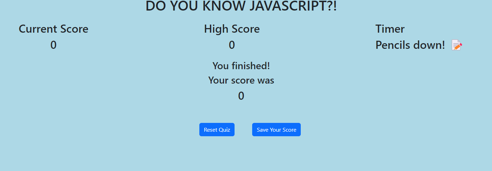

# JavaScript-Quiz

## Description

This project allows a user to test their knowledge on several questions of JavaScript:

- Building this project allowed me to familiarize myself with arrays and event listeners even more.
- The quiz can have more or less questions added and continue functioning as normal. It allowed me to create something functional but that can be added to easily.

## Installation

The quiz can be accessed at:

https://chasechambers.github.io/JavaScript-Quiz/

## Usage

Provide instructions and examples for use. Include screenshots as needed.

To add a screenshot, create an `assets/images` folder in your repository and upload your screenshot to it. Then, using the relative filepath, add it to your README using the following syntax:

   
## Credits

List your collaborators, if any, with links to their GitHub profiles.

If you used any third-party assets that require attribution, list the creators with links to their primary web presence in this section.

If you followed tutorials, include links to those here as well.

Work on this project was completed with the help of:

Code review and advice by: Rachel Croteau
Code review and advice through: AskBCS tool
Code guides through sites such as MDN, W3 Schools, and StackOverflow.
Code discussion with: James Levesque - Student in class. Github unknown

## Features

Question and answer section
Highscore gets stored to local storage and displayed

## Tests

Quiz can be completed multiple times to try and get a higher score